# ScholarQA Pipeline Documentation

## Project Overview

ScholarQA is a scientific query answering and literature review generation system built on RAG (Retrieval-Augmented Generation) architecture. It processes scientific queries through a multi-step pipeline that retrieves relevant papers, extracts quotes, and generates comprehensive summaries with proper citations.

## Pipeline Flow Chart

```mermaid
flowchart TD
    Start([User Query]) --> Init[Initialize ScholarQA with PaperFinder, LLM Models, etc.]
    Init --> TaskID[Generate UUID Task ID]
    TaskID --> PreProcess[Preprocess Query]

    PreProcess --> Validate{Validate Query for Harmful Content?}
    Validate -->|Yes| ValidateStep[Check for harmful/unanswerable content]
    Validate -->|No| Decompose
    ValidateStep --> Decompose[Decompose Query with LLM]

    Decompose --> DecomposeDetails[Extract: Year filters, Venue filters, Field of Study, Citations, Rewritten query, Keyword query]
    DecomposeDetails --> Retrieval[Find Relevant Papers]

    Retrieval --> RetrievePassages[Retrieve passages from 8M+ papers using rewritten query]
    RetrievePassages --> PassageCount[Get snippet_results with corpus_ids]
    PassageCount --> KeywordCheck{Has keyword_query?}

    KeywordCheck -->|Yes| KeywordSearch[Retrieve additional papers via Semantic Scholar API]
    KeywordCheck -->|No| FilterDupes
    KeywordSearch --> FilterDupes[Filter out duplicate corpus_ids]
    FilterDupes --> CombineResults[Combine snippet_results + search_api_results]

    CombineResults --> CheckResults{Has retrieved candidates?}
    CheckResults -->|No| ErrorNoResults[Throw Exception: No relevant information]
    CheckResults -->|Yes| Rerank

    Rerank --> RerankCheck{n_rerank > 0?}
    RerankCheck -->|Yes| RerankStep[Rerank with cross-encoder model]
    RerankCheck -->|No| Aggregate
    RerankStep --> Aggregate[Aggregate passages into DataFrame by paper]

    Aggregate --> GetMetadata[Fetch paper metadata for corpus_ids]
    GetMetadata --> CheckEmpty{DataFrame empty?}
    CheckEmpty -->|Yes| ErrorNoRerank[Throw Exception: No relevant papers post reranking]
    CheckEmpty -->|No| Step1

    Step1[STEP 1: Quote Extraction] --> ExtractQuotes[Extract salient quotes from each paper using LLM]
    ExtractQuotes --> QuoteCheck{Has quotes?}
    QuoteCheck -->|No| ErrorNoQuotes[Throw Exception: No relevant quotes extracted]
    QuoteCheck -->|Yes| Step2

    Step2[STEP 2: Clustering & Planning] --> ClusterQuotes[Cluster quotes into meaningful dimensions/sections]
    ClusterQuotes --> CreatePlan[Generate organization plan with section names and formats]
    CreatePlan --> PlanCheck{Plan has content?}
    PlanCheck -->|No| ErrorNoPlan[Throw Exception: Planning failed to cluster documents]
    PlanCheck -->|Yes| Citations

    Citations[STEP 2.1: Extract Citation Metadata] --> MapQuotes[Map quotes to full passages in DataFrame]
    MapQuotes --> FindCitations[Find inline citations within quote ranges]
    FindCitations --> FetchCiteMetadata[Fetch metadata for additional citation corpus_ids]
    FetchCiteMetadata --> LinkCitations[Replace corpus_ids with author citations in quotes]

    LinkCitations --> Step3[STEP 3: Generate Iterative Summary]
    Step3 --> EstimateTime[Calculate task time: 30 + 15 * num_sections minutes]
    EstimateTime --> GenerateLoop{For each section in plan}

    GenerateLoop --> GenSection[Generate section text using quotes and plan]
    GenSection --> ProcessJSON[Convert text to JSON with citations]
    ProcessJSON --> TableCheck{Section format is 'list' AND has citations AND table generation enabled?}

    TableCheck -->|Yes| StartTableThread[Start table generation thread]
    TableCheck -->|No| NextSection
    StartTableThread --> NextSection{More sections?}
    NextSection -->|Yes| GenerateLoop
    NextSection -->|No| WaitTables

    WaitTables[Wait for all table generation threads] --> AttachTables[Attach generated tables to sections]
    AttachTables --> TraceEvent[Log all events and costs to EventTrace]
    TraceEvent --> Return[Return TaskResult with sections, costs, tokens]

    Return --> End([Complete])

    ErrorNoResults --> End
    ErrorNoRerank --> End
    ErrorNoQuotes --> End
    ErrorNoPlan --> End

    style Start fill:#e1f5fe
    style End fill:#c8e6c9
    style Step1 fill:#fff3e0
    style Step2 fill:#fff3e0
    style Citations fill:#fff3e0
    style Step3 fill:#fff3e0
    style ErrorNoResults fill:#ffcdd2
    style ErrorNoRerank fill:#ffcdd2
    style ErrorNoQuotes fill:#ffcdd2
    style ErrorNoPlan fill:#ffcdd2
```

## Component Interaction Sequence Diagram

```mermaid
sequenceDiagram
    participant User
    participant ScholarQA
    participant LLMCaller
    participant PaperFinder
    participant MultiStepPipeline
    participant StateMgr
    participant EventTrace
    participant TableGenerator

    User->>ScholarQA: answer_query(query)
    ScholarQA->>ScholarQA: Generate UUID task_id
    ScholarQA->>StateMgr: Initialize LocalStateMgrClient
    ScholarQA->>EventTrace: Create EventTrace with task_id

    Note over ScholarQA: STEP 0: Query Preprocessing
    ScholarQA->>ScholarQA: update_task_state("Processing user query")
    alt Validation enabled
        ScholarQA->>ScholarQA: validate(query) - check harmful content
    end
    ScholarQA->>LLMCaller: call_method(decompose_query)
    LLMCaller->>MultiStepPipeline: Call LLM for query decomposition
    MultiStepPipeline-->>LLMCaller: LLMProcessedQuery(rewritten_query, keyword_query, search_filters)
    LLMCaller-->>ScholarQA: CostAwareLLMResult with processed query
    ScholarQA->>EventTrace: trace_decomposition_event()

    Note over ScholarQA: RETRIEVAL PHASE
    ScholarQA->>ScholarQA: update_task_state("Retrieving relevant passages")
    ScholarQA->>PaperFinder: retrieve_passages(rewritten_query, **search_filters)
    PaperFinder->>PaperFinder: Query Semantic Scholar index (8M+ papers)
    PaperFinder-->>ScholarQA: snippet_results (List[Dict])

    alt Has keyword_query
        ScholarQA->>PaperFinder: retrieve_additional_papers(keyword_query, **search_filters)
        PaperFinder->>PaperFinder: Query Semantic Scholar API
        PaperFinder-->>ScholarQA: search_api_results (List[Dict])
        ScholarQA->>ScholarQA: Filter duplicates by corpus_id
    end

    ScholarQA->>ScholarQA: Combine snippet_results + search_api_results
    ScholarQA->>EventTrace: trace_retrieval_event()

    Note over ScholarQA: RERANKING PHASE
    alt n_rerank > 0
        ScholarQA->>ScholarQA: update_task_state("Re-rank and aggregate passages")
        ScholarQA->>PaperFinder: rerank(query, retrieved_candidates)
        PaperFinder->>PaperFinder: Cross-encoder reranking
        PaperFinder-->>ScholarQA: reranked_candidates
    end

    ScholarQA->>ScholarQA: get_paper_metadata() - fetch metadata for corpus_ids
    ScholarQA->>PaperFinder: aggregate_into_dataframe()
    PaperFinder-->>ScholarQA: scored_df (pandas DataFrame)
    ScholarQA->>EventTrace: trace_rerank_event()

    Note over ScholarQA: STEP 1: Quote Extraction
    ScholarQA->>ScholarQA: update_task_state("Extracting salient key statements")
    ScholarQA->>LLMCaller: call_method(step_select_quotes)
    LLMCaller->>MultiStepPipeline: step_select_quotes(query, scored_df)
    MultiStepPipeline->>MultiStepPipeline: Process each paper with LLM
    MultiStepPipeline-->>LLMCaller: per_paper_summaries (Dict[ref_str, quotes])
    LLMCaller-->>ScholarQA: CostAwareLLMResult with quotes
    ScholarQA->>EventTrace: trace_quote_event()

    Note over ScholarQA: STEP 2: Clustering & Planning
    ScholarQA->>ScholarQA: update_task_state("Synthesizing answer outline")
    ScholarQA->>LLMCaller: call_method(step_clustering)
    LLMCaller->>MultiStepPipeline: step_clustering(query, per_paper_summaries)
    MultiStepPipeline->>MultiStepPipeline: Cluster quotes into dimensions with LLM
    MultiStepPipeline-->>LLMCaller: cluster_json with dimensions[{name, format, quotes}]
    LLMCaller-->>ScholarQA: CostAwareLLMResult with plan
    ScholarQA->>ScholarQA: Convert to plan_json format
    ScholarQA->>EventTrace: trace_clustering_event()

    Note over ScholarQA: STEP 2.1: Citation Processing
    ScholarQA->>ScholarQA: passage_to_quotes_metadata() - map quotes to passages
    loop For each quote in each paper
        ScholarQA->>ScholarQA: Find quote in passage text (exact/fuzzy match)
        ScholarQA->>ScholarQA: Extract inline citations within quote ranges
        ScholarQA->>ScholarQA: Map sentence_offsets and ref_mentions
    end
    ScholarQA->>ScholarQA: get_paper_metadata() - fetch additional citation metadata
    ScholarQA->>ScholarQA: populate_citations_metadata() - replace corpus_ids with author citations
    ScholarQA->>EventTrace: trace_inline_citation_following_event()

    Note over ScholarQA: STEP 3: Iterative Summary Generation
    ScholarQA->>ScholarQA: Calculate task_estimated_time (30 + 15*sections minutes)
    ScholarQA->>ScholarQA: update_task_state("Start generating sections")
    ScholarQA->>LLMCaller: call_iter_method(generate_iterative_summary)
    LLMCaller->>MultiStepPipeline: generate_iterative_summary(query, quotes, plan)

    loop For each section in plan
        ScholarQA->>ScholarQA: update_task_state("Generating section X of Y")
        MultiStepPipeline->>MultiStepPipeline: Generate section text with LLM
        MultiStepPipeline-->>ScholarQA: section_text (via generator)
        ScholarQA->>ScholarQA: get_json_summary() - convert to structured JSON
        ScholarQA->>ScholarQA: postprocess_json_output()

        alt Section format is "list" AND has citations AND table_generation enabled
            ScholarQA->>TableGenerator: gen_table_thread() - start async table generation
            TableGenerator->>TableGenerator: run_table_generation() in separate thread
        end

        ScholarQA->>ScholarQA: get_gen_sections_from_json() - create GeneratedSection
        ScholarQA->>ScholarQA: Add to generated_sections list
    end

    Note over ScholarQA: TABLE PROCESSING
    ScholarQA->>ScholarQA: update_task_state("Generating comparison tables")
    loop For each table thread
        ScholarQA->>TableGenerator: thread.join() - wait for completion
        TableGenerator-->>ScholarQA: (table, costs) tuple
    end
    ScholarQA->>ScholarQA: Attach tables to corresponding sections
    ScholarQA->>ScholarQA: Final postprocess_json_output()

    Note over ScholarQA: COMPLETION
    ScholarQA->>EventTrace: trace_summary_event() - log final results and costs
    ScholarQA->>EventTrace: persist_trace() - save to logs
    ScholarQA->>ScholarQA: Create TaskResult(sections, cost, tokens)
    ScholarQA-->>User: TaskResult with generated sections and metadata
```

## Detailed Pipeline Steps

### Step 0: Query Preprocessing
- **Input**: Raw user query string
- **Process**:
  - Validates query for harmful/unanswerable content (if enabled)
  - Uses LLM to decompose query into structured components
- **Output**: `LLMProcessedQuery` containing:
  - `rewritten_query`: Optimized version for semantic search
  - `keyword_query`: Version for keyword-based search
  - `search_filters`: Year, venue, field of study filters

### Retrieval Phase
- **ES Search**: Queries ES vector index with rewritten query
- **Keyword Search**: Queries ES API with keyword query (if available)
- **Data Sources**: 1000 papers
- **Output**: Combined list of relevant paper passages with corpus IDs

### Reranking Phase
- **Model**: Cross-encoder reranking model (mixedbread-ai/mxbai-rerank-large-v1)
- **Process**: Scores passage relevance to original query
- **Aggregation**: Groups passages by paper, creates pandas DataFrame
- **Output**: Top N most relevant papers (default: 50)

### Step 1: Quote Extraction
- **Input**: Reranked papers DataFrame
- **Process**: LLM extracts salient quotes from each paper
- **System Prompt**: `SYSTEM_PROMPT_QUOTE_PER_PAPER`
- **Output**: Dictionary mapping reference strings to extracted quotes

### Step 2: Clustering & Planning
- **Input**: Extracted quotes from all papers
- **Process**: LLM clusters quotes into coherent sections/dimensions
- **System Prompt**: `SYSTEM_PROMPT_QUOTE_CLUSTER`
- **Output**: Organization plan with section names, formats, and quote assignments

### Step 2.1: Citation Processing
- **Quote Mapping**: Maps LLM-extracted quotes back to original passage text
- **Citation Extraction**: Finds inline citations within quote text ranges
- **Metadata Fetching**: Retrieves paper metadata for cited works
- **Citation Formatting**: Replaces corpus IDs with author-year format

### Step 3: Iterative Summary Generation
- **Input**: Extended quotes with citations, organization plan
- **Process**: Generates summary sections iteratively
- **System Prompt**: `PROMPT_ASSEMBLE_SUMMARY`
- **Output**: Structured sections with embedded citations

### Table Generation (Optional)
- **Trigger**: List-format sections with citations
- **Process**: Async generation of comparison tables
- **Output**: Structured tables attached to relevant sections

## Data Flow Details

### What ScholarQA Receives
- **User Query**: Natural language scientific question
- **Paper Data**: Full-text passages, abstracts, metadata from ES
- **LLM Responses**: Processed queries, quotes, plans, summaries
- **Citation Data**: Inline references with corpus IDs and metadata

### What ScholarQA Processes
1. **Query Analysis**: Extracts filters and rewrites for optimal retrieval
2. **Relevance Scoring**: Ranks papers by semantic similarity to query
3. **Information Extraction**: Pulls key statements from relevant papers
4. **Organization**: Structures information into logical sections
5. **Citation Linking**: Connects quotes to their source papers and references

### How Retrieval Works
- **Dual Strategy**: Semantic search + keyword search for comprehensive coverage
- **Deduplication**: Removes overlapping results between search methods
- **Quality Filtering**: Uses relevance thresholds to maintain high precision
- **Reranking**: Cross-encoder model provides fine-grained relevance scoring

### How Analysis Works
- **Text Matching**: Maps extracted quotes to original passage text (exact + fuzzy)
- **Offset Tracking**: Uses character positions to locate citations within quotes
- **Metadata Enrichment**: Fetches additional paper details for comprehensive citations
- **Format Standardization**: Converts citations to consistent author-year format

## Key Configuration Parameters

- **n_retrieval**: Initial passages retrieved (default: 256)
- **n_rerank**: Top papers after reranking (default: 50)
- **context_threshold**: Minimum relevance score for inclusion
- **llm_model**: Primary model for generation (gemini)
- **fallback_llm**: Backup models for reliability
- **run_table_generation**: Enable/disable table creation

## Error Handling

The pipeline includes comprehensive error handling at each stage:
- **No Retrieval Results**: Throws exception if no relevant papers found
- **Empty Reranking**: Handles cases where reranking eliminates all candidates
- **No Quote Extraction**: Fails gracefully if LLM cannot extract relevant quotes
- **Planning Failure**: Catches clustering failures and provides meaningful errors
- **LLM Cache Invalidation**: Retries with fresh cache on generation failures

## Performance Characteristics

- **Total Runtime**: ~3 minutes for typical queries
- **Retrieval**: ~5-10 seconds for passage retrieval
- **Reranking**: ~10 seconds for cross-encoder scoring
- **Quote Extraction**: ~15 seconds per batch of papers
- **Summary Generation**: ~15 seconds per section
- **Table Generation**: ~20 seconds (parallel with other processing)

## Code References

### Core Files
- **Main Pipeline**: `api/scholarqa/scholar_qa.py:448` - `run_qa_pipeline()` method
- **Query Preprocessing**: `api/scholarqa/scholar_qa.py:98` - `preprocess_query()` method
- **Retrieval**: `api/scholarqa/scholar_qa.py:113` - `find_relevant_papers()` method
- **Quote Extraction**: `api/scholarqa/scholar_qa.py:166` - `step_select_quotes()` method
- **Clustering**: `api/scholarqa/scholar_qa.py:190` - `step_clustering()` method
- **Summary Generation**: `api/scholarqa/scholar_qa.py:203` - `step_gen_iterative_summary()` method

### Key Data Structures
- **LLMProcessedQuery**: Contains rewritten query, keyword query, and search filters
- **TaskResult**: Final output with generated sections, costs, and token counts
- **GeneratedSection**: Individual section with title, text, citations, and optional table
- **CitationSrc**: Citation metadata with paper information and relevance scores

### Integration Points
- **PaperFinder**: Retrieval system interface for different retrieval backends
- **MultiStepQAPipeline**: Generation pipeline for LLM-based processing steps
- **EventTrace**: Logging and monitoring system for pipeline execution
- **TableGenerator**: Async table generation for structured data presentation

This comprehensive pipeline ensures high-quality scientific literature reviews with proper citations, structured organization, and rich metadata for downstream applications.