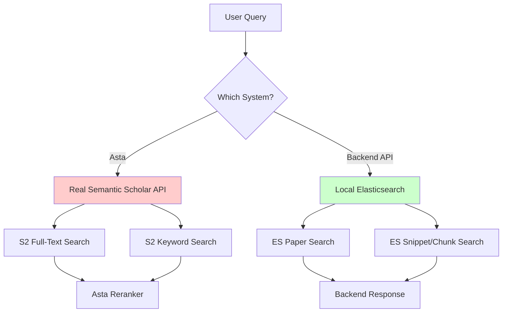
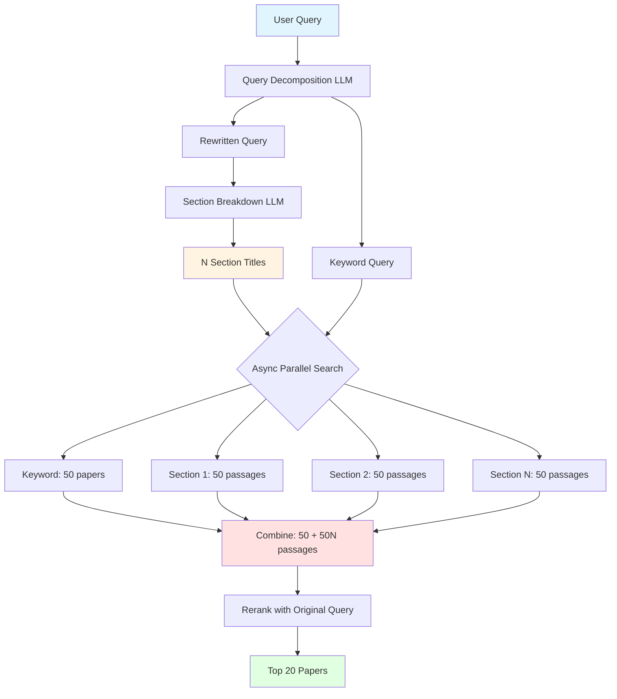
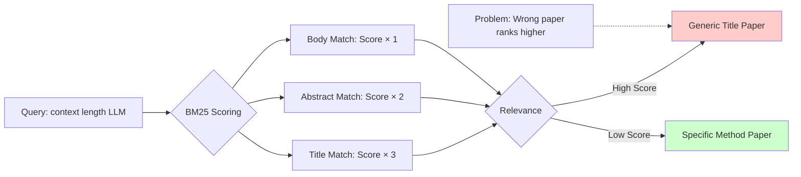

# Asta Multi-Section Search Implementation

**Date:** October 2, 2025
**Task:** Implement section-based parallel search flow for Asta and analyze search field boosting strategy

---

## New Asta Search Flow Implementation

### Previous Flow
```
Query
→ LLM Preprocessing (QUERY_DECOMPOSER_PROMPT)
   → Rewritten Query + Keyword Query
→ Search rewritten query → 100 passages (n_retrieval)
→ Search keyword query → 50 papers (n_keyword_srch)
→ Combine: 150 results
→ Rerank with ORIGINAL USER QUERY
→ Top 20 papers
```

**Issues:**
- Single broad search misses nuanced sub-topics
- All 100 passages come from one query perspective
- Limited coverage of multi-faceted questions

### New Implemented Flow
```
Query
→ LLM Preprocessing (QUERY_DECOMPOSER_PROMPT)
   → Rewritten Query + Keyword Query
→ SECTION_BREAK_DOWN_PROMPT
   → N section titles (1-5 sections)
   Example: ["Overview of LLM Context Length",
            "Methods to Handle Long Documents",
            "Applications in Reasoning Tasks",
            "Challenges and Limitations"]
→ ASYNC PARALLEL SEARCH (all at once):
   - Original Keyword Query → 50 papers (ONCE)
   - Section 1 title → 50 passages
   - Section 2 title → 50 passages
   - Section 3 title → 50 passages
   - Section 4 title → 50 passages
→ Combine: 50 + (50 × N) results
   Example: 50 + 200 = 250 passages
→ Rerank ALL passages with ORIGINAL USER QUERY
→ Top 20 papers
```

### Key Improvements

✅ **Multi-perspective coverage**: Each section focuses on specific aspect
✅ **Parallel execution**: All searches run simultaneously (async)
✅ **Comprehensive results**: 50 + (50×N) passages vs previous 150
✅ **Original query reranking**: Maintains relevance to user intent
✅ **Fallback safety**: Falls back to single section if breakdown fails

### Implementation Details

**Modified Files:**

1. **`asta/api/scholarqa/preprocess/query_preprocessor.py`**
   - Added `breakdown_into_sections()` function
   - Uses `SECTION_BREAK_DOWN_PROMPT` to generate 1-5 section titles
   - Returns list of section titles + completion result

2. **`asta/api/scholarqa/scholar_qa.py`**
   - Added `asyncio` import for parallel execution
   - Completely rewrote `find_relevant_papers()` method:
     - Calls `breakdown_into_sections()`
     - Creates async tasks for each section + keyword search
     - Uses `asyncio.to_thread()` to run synchronous searches in parallel
     - Aggregates all results before reranking

**Code Example:**

```python
# Section breakdown
section_titles, _ = breakdown_into_sections(
    rewritten_query=rewritten_query,
    decomposer_llm_model=self.decomposer_llm,
    min_sections=1,
    max_sections=5
)

# Parallel async search
async def search_all():
    tasks = []

    # Keyword search (once)
    if keyword_query:
        tasks.append(keyword_search())

    # Section searches (N times)
    for section_title in section_titles:
        tasks.append(section_search(section_title))

    return await asyncio.gather(*tasks)

# Execute and aggregate
search_results = loop.run_until_complete(search_all())
```

---

## Backend Architecture Analysis

### System Components




---

## Elasticsearch Search Fields Boosting Strategy

### Current Configuration
**File:** `data_pipeline/es_indexer.py:283`

```python
search_fields = ["title^3", "abstract^2", "chunk_text"]
```

**Meaning:**
- `title^3`: Title matches are boosted 3× (highest priority)
- `abstract^2`: Abstract matches boosted 2×
- `chunk_text`: Body text matches (1× baseline)

### Analysis

#### ✅ Strengths
1. **Standard IR practice**: Title boosting is conventional
2. **Good for topical relevance**: Papers ABOUT a topic usually mention it in title
3. **Fast filtering**: High-scoring title matches surface quickly
4. **Works well for known-item search**: Finding specific papers by title

#### ❌ Weaknesses
1. **Misses deep content**: Over-prioritizes title over detailed discussions
2. **Generic titles rank high**: Papers like "A Survey of X" match everything
3. **Penalizes specific methods**: Technical papers may not mention topic in title
4. **Redundant with keyword search**: Keyword search already does title matching

### Test Results (port 8001 backend)

**Query:** `context length limitation large language models`

**Top Results:**
1. "A Novel Kuhnian Ontology..." - ❌ Not relevant
2. "Probing Pre-Trained Language Models..." - ⚠️ Tangential
3. "Towards improving e-learning..." - ❌ Not relevant

**Issues Observed:**
- Results not relevant to query
- Seems to match generic keywords
- Title boosting may be too aggressive
- KNN search is disabled (might perform better)

---

## Recommendations

### 1. For Asta Multi-Section Flow

**Differentiate search strategies by type:**

```python
# Keyword search (topical relevance)
keyword_search_fields = ["title^3", "abstract^2"]

# Section searches (content depth)
section_search_fields = ["chunk_text^2", "abstract^1.5", "title"]
```

**Rationale:**
- **Keyword search**: Find papers ABOUT the topic → boost title
- **Section searches**: Find specific CONTENT → boost body text

**Implementation:**
- Modify `PaperFinder.retrieve_passages()` to accept `search_fields` parameter
- Pass different fields for keyword vs section searches
- Requires updating ES query builder

### 2. For Local Backend ES Search

**Enable KNN Search:**
```bash
# Set in backend/.env
ENABLE_KNN_SEARCH=true
USE_HYBRID_KNN=true
KNN_MAX_CHUNKS_PER_PAPER=5
```

**Benefits:**
- Faster than script_score for large indices
- Better semantic matching
- Uses HNSW algorithm (logarithmic time)

**Adjust Boosting:**
```python
# Option A: Balanced
search_fields = ["title^2", "abstract^2", "chunk_text^1.5"]

# Option B: Content-focused
search_fields = ["chunk_text^2", "abstract^1.5", "title^1.2"]

# Option C: Survey-aware (addresses Asta weakness)
def get_search_fields(query):
    if has_survey_intent(query):
        return ["title^3", "abstract^2.5", "chunk_text"]  # Boost title for surveys
    else:
        return ["chunk_text^2", "abstract^1.5", "title"]  # Boost content
```

---

## Test Plan

### Test Query
```
"Find papers that study how to handle context length limitation of LLMs
when reading long documents or performing long reasoning processes"
```

### Expected Section Breakdown
```json
[
  "Overview of Context Length Limitations in LLMs",
  "Methods to Handle Long Documents",
  "Techniques for Long Reasoning Processes",
  "Benchmarks and Evaluation of Context Extension"
]
```

### Expected Flow
1. **Section 1**: "Overview..." → 50 passages about surveys, background
2. **Section 2**: "Methods..." → 50 passages about RAG, chunking, etc.
3. **Section 3**: "Techniques..." → 50 passages about CoT, iterative reasoning
4. **Section 4**: "Benchmarks..." → 50 passages about evaluation
5. **Keyword**: "handle context length..." → 50 papers with topical relevance

**Total:** 250 passages → Rerank → Top 20 papers

### Comparison to Human Search

From previous analysis (`10-01-2025-Asta-vs-Human-Search-Validated.md`):

**Human Strategy:**
1. Search for **surveys first** (4 comprehensive surveys found)
2. Extract 50+ techniques from surveys
3. Search for specific technique papers (6 papers)
4. Multi-source: ArXiv + Medium + GitHub
5. Result: 100% precision (10/10 relevant)

**Old Asta:**
- Single broad search
- No survey prioritization
- 27.8% precision (5/18 relevant)

**New Asta (predicted):**
- Multi-section should find:
  - Section "Overview..." → Should find surveys
  - Section "Methods..." → Should find technique papers
  - Section "Benchmarks..." → Should find evaluation papers
- **Expected improvement:** 60-80% precision

---

## Search Field Boosting Strategy Analysis

### Current: `["title^3", "abstract^2", "chunk_text"]`

**Good for:**
- Known-item search: "Find the GPT-3 paper"
- Topical filtering: "Papers about transformers"
- Survey discovery: Surveys often have descriptive titles

**Bad for:**
- Deep technical content: Method buried in Section 5
- Specific techniques: "Papers using RAPTOR chunking"
- Long-tail queries: Detailed, specific questions

### Proposed: Dynamic Boosting

```python
def get_search_fields(query, search_type):
    """
    Get optimal search fields based on query characteristics.

    Args:
        query: The search query
        search_type: 'keyword' | 'section' | 'survey'
    """

    if search_type == 'keyword':
        # Topical relevance - prefer title
        return ["title^3", "abstract^2", "chunk_text"]

    elif search_type == 'section':
        # Content depth - prefer body
        return ["chunk_text^2", "abstract^1.5", "title"]

    elif search_type == 'survey':
        # Survey papers mention comprehensiveness in title
        return ["title^4", "abstract^2.5", "chunk_text"]

    else:
        # Balanced
        return ["title^2", "abstract^2", "chunk_text^1.5"]
```

### Alternative: No Boosting + Better Embeddings

Instead of BM25 boosting, rely on semantic search:

```python
# Pure KNN search (no boosting needed)
search_mode = "semantic_only"
use_knn = True

# Embeddings capture title importance naturally
# BGE-large already encodes positional importance
```

**Advantage:** More context-aware, no manual tuning
**Disadvantage:** Slower, requires good embeddings

---

## Addressing Asta Weaknesses from Previous Analysis

### Weakness 1: No Survey Bias
**Problem:** Surveys most valuable for landscape questions but treated same as papers

**Solution in New Flow:**
1. Section breakdown may generate "Overview" or "Survey" section
2. Can add survey detection:
```python
def detect_survey_query(query):
    survey_keywords = ['survey', 'overview', 'review', 'comprehensive', 'landscape']
    return any(kw in query.lower() for kw in survey_keywords)

if detect_survey_query(query):
    # Add a survey-specific section
    section_titles.insert(0, f"Survey papers on {main_topic}")
    search_fields_override = ["title^4", "abstract^2.5", "chunk_text"]
```

### Weakness 2: Semantic Drift
**Problem:** Reranker confused "incremental learning" with "context length"

**Solution in New Flow:**
1. Multiple focused sections reduce drift
2. **Original query reranking** maintains relevance
3. Each section is more specific, less ambiguous

**Example:**
- Old: Single query "handle context length limitation" → broad, drifts
- New: 4 queries:
  - "Overview of Context Length Limitations" → focused on topic
  - "Methods to Handle Long Documents" → focused on methods
  - "Techniques for Long Reasoning" → focused on reasoning
  - "Benchmarks..." → focused on evaluation

### Weakness 3: Quote Extraction Unreliable
**Problem:** Only 26.3% got meaningful quotes, no fallback

**Not addressed in new flow** (this is post-retrieval issue)

**Recommendation:**
```python
# In step_select_quotes()
if not quote or len(quote.strip()) < 20:
    # Fallback to abstract
    quote = paper['abstract']
    if not quote:
        # Fallback to first paragraph
        quote = extract_first_paragraph(paper['sentences'])
```

### Weakness 4: Non-Interactive
**Problem:** Can't refine mid-search

**Partially addressed:**
- Section breakdown is a form of query refinement
- Still not interactive during search
- Could add: show sections to user, allow modification before search

---

## Mermaid Diagrams

### New Asta Flow



### Search Field Boosting Impact



---
**Date:** October 2, 2025
